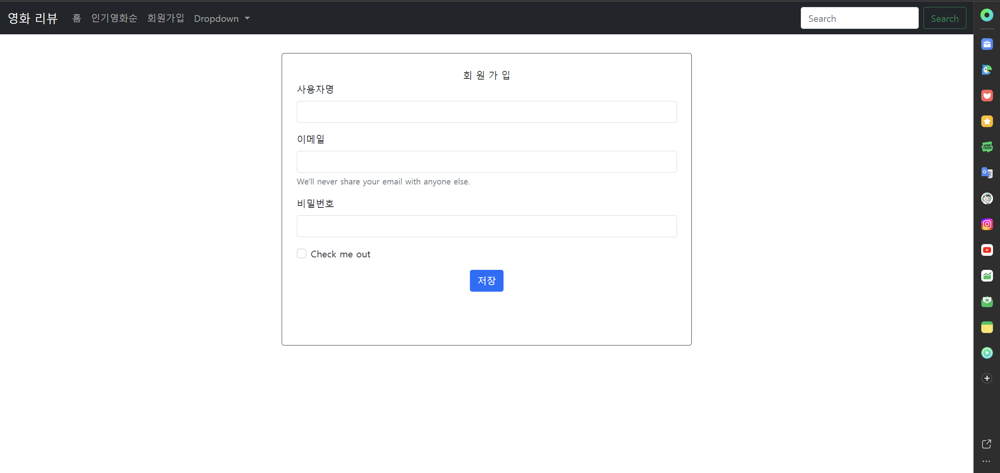

# SpringBoot-movie-Thymeleaf Project

## use Stack 
- Spring Boot , Thymeleaf , PostMan 

### Day1 ~ 6

- API Test
- API 파싱해 온 데이터 맵핑
- ApiResonse 생성 및 객체 맵핑
- MainController 생성
- movieService getPopular 메소드 생성
- README.md 작성
------------------
1. local에서는 정상적으로 출력되지만 배포 시 출력이 되지 않는 문제 발생하여 롤백 하고 처음부터 다시 만들면서 수정 
2. 테이블 형식으로 데이터 나오도록 수정 
3. navbar 색상 변경

-------------------
1. User 엔티티 생성

-------------------

1. Index화면의 fragments 분리 

-------------------
1. 회원가입 폼 작성 및 테스트 (Thymeleaf)
2. fragments로 분리하기
3. 게시글 관련 엔티티 작성

### Day 7 24-03-23

1. 영화 디테일 페이지 작성 중 
2. User 엔티티에 INDEX 적용 (username , email)

### Day 8 24-03-31
1. 회원가입 폼 작성 완료

