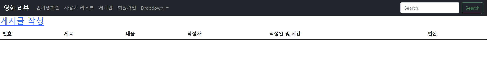
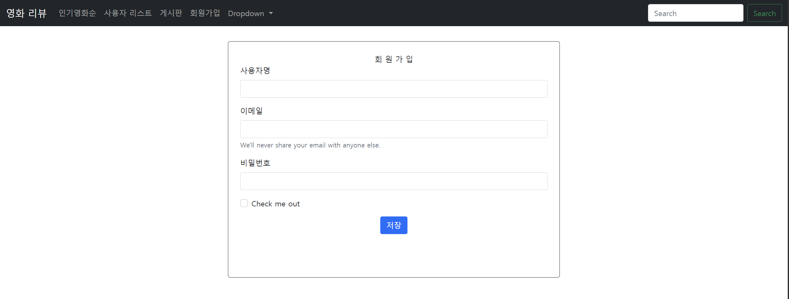
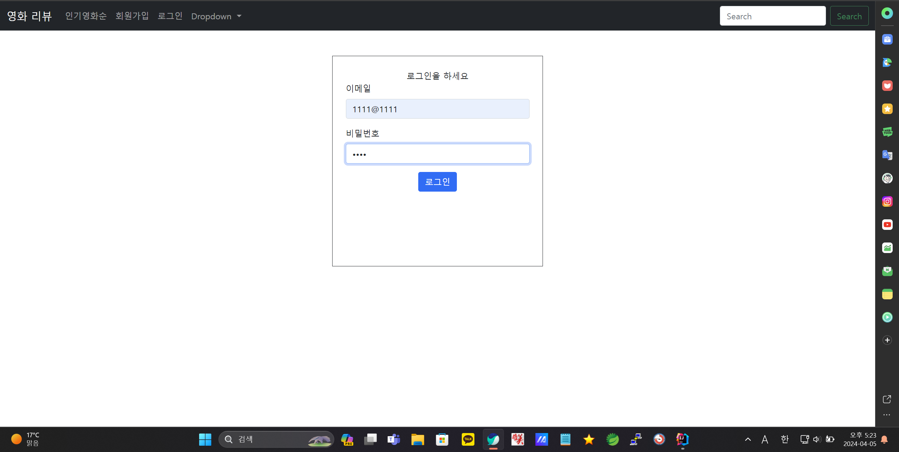
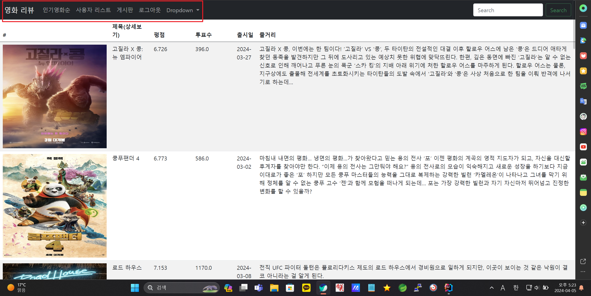
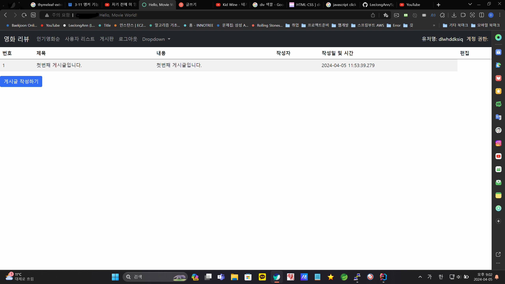
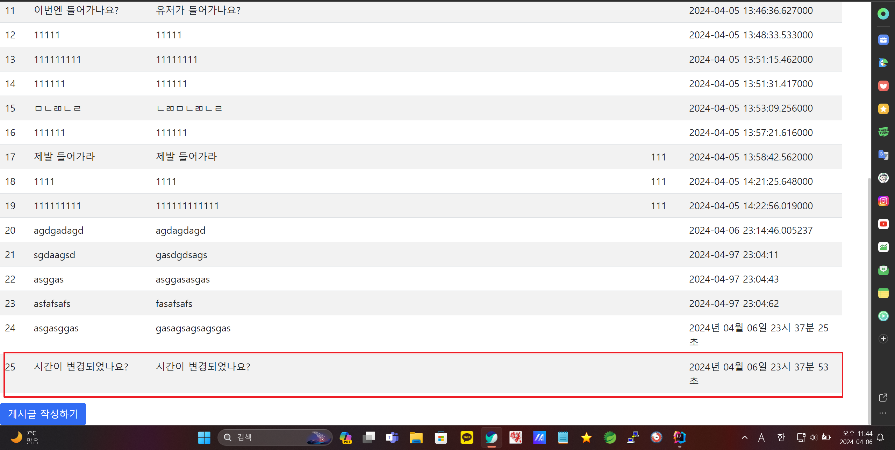
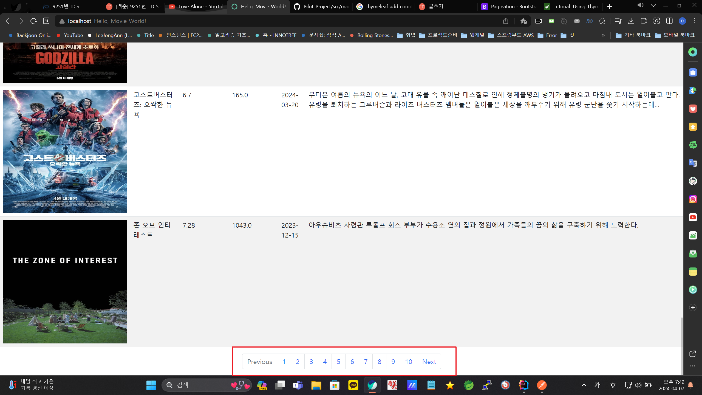
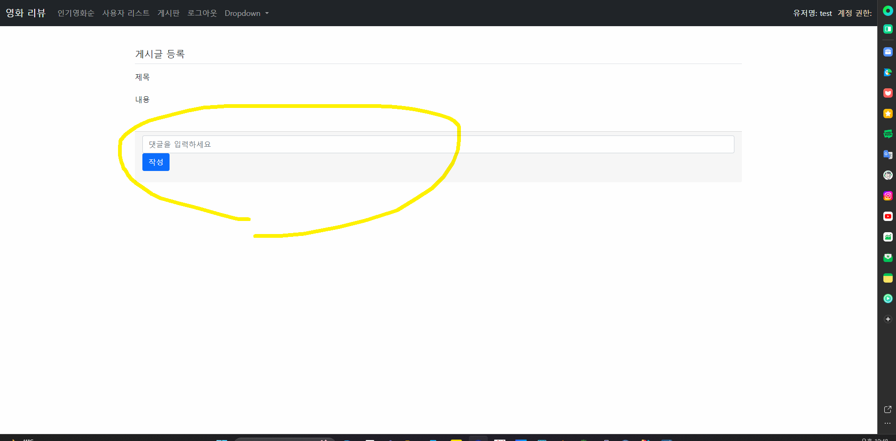

# SpringBoot-movie-Thymeleaf Project

## use Stack 
- Spring Boot , Thymeleaf , PostMan 

### Day1 ~ 6

- API Test
- API 파싱해 온 데이터 맵핑
- ApiResonse 생성 및 객체 맵핑
- MainController 생성
- movieService getPopular 메소드 생성
- README.md 작성
------------------
1. local에서는 정상적으로 출력되지만 배포 시 출력이 되지 않는 문제 발생하여 롤백 하고 처음부터 다시 만들면서 수정 
2. 테이블 형식으로 데이터 나오도록 수정 
3. navbar 색상 변경

-------------------
1. User 엔티티 생성

-------------------

1. Index화면의 fragments 분리 

-------------------
1. 회원가입 폼 작성 및 테스트 (Thymeleaf)
2. fragments로 분리하기
3. 게시글 관련 엔티티 작성

### Day 7 24-03-23

1. 영화 디테일 페이지 작성 중 
2. User 엔티티에 INDEX 적용 (username , email)

### Day 8 24-03-31
1. 회원가입 폼 작성 완료

### Day 8 24-04-02
1. table 형태 변경 (조금 더 깔끔하게)
2. Bootstrap Icon 추가
3. User List에서 삭제 기능 추가 ( 쓰레기통 누를 시 삭제 됨 )

추가
4. 게시판 기본적인 형태 작성
5. 권한 설정을 위한 Role 엔티티 추가

### Day 24-04-02 ~ 24-04-04
1. Security 설정 추가 
2. 로그인 기능 추가 
3. 비밀번호 암호화 추가

### Day 24-04-05
1. 로그인 전과 로그인 시 네비게이션 바 화면 변경
2. 로그아웃 기능 추가 
3. 게시글 작성 폼 추가 
4. 게시글 작성 기능 추가 

### Day 24-04-06

1. 게시글 작성 시 타임 포맷 변경 ( Date -> String ) changeTimeFormatNow 추가

### Day 24-04-07

1. api로 받아온 데이터의 페이징 처리 추가
2. 페이징 처리로 인한 주소값들 수정

### Day 24-04-09
1. Board 게시글 작성자 표시 안되는 오류 수정
2. Board 게시글 삭제 시 redirectAttribute 추가

### Day 24-04-11
1. Role 관련한 문제 수정 중 
2. 게시글 상세 조회 페이지 작성 중 
